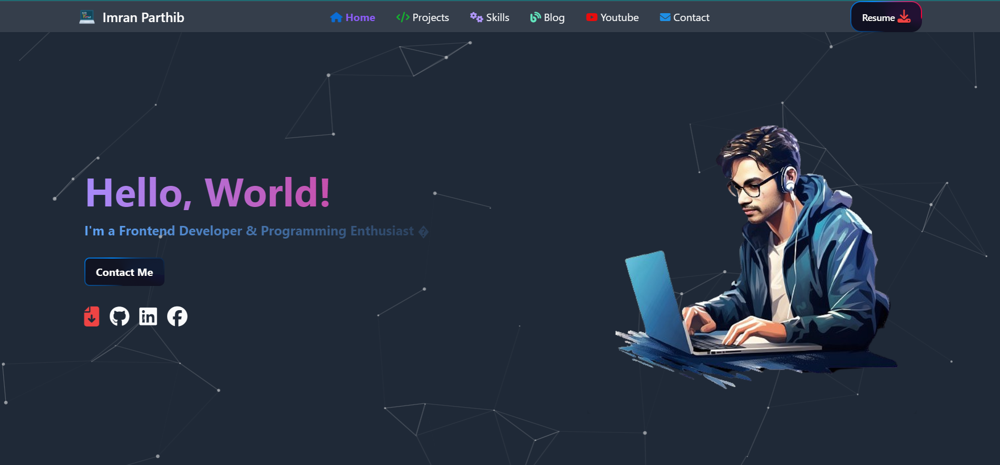

<table>
    <tr>
        <td width="65%">
            <h1>Hi 👋, I'm Imran Parthib</h1>
            

    I am a Computer Science and Engineering student and a passionate front-end web developer from Bangladesh. I specialize in building responsive and engaging web experiences with proficiency in HTML5, CSS3, Bootstrap, Tailwind, JavaScript, and React. I continuously enhance my skills and expand into backend development with Node.js, Express, and MongoDB/(Supabase,Firebase) while exploring emerging fields like AI and blockchain technologies.  💻

    In addition to web development, I have experience with C, C++, Java, and Python, and I possess strong knowledge of data structures, algorithms, and object-oriented programming. I enjoy problem-solving on platforms such as URI, HackerRank, and Codeforces, and am passionate about working with Python and Linux. Outside of coding, I love reading and writing, which help fuel my creativity. 📚

 

    I am open to collaborating on projects, sharing ideas, or discussing the latest tech trends. Let's connect and explore exciting opportunities together! #ComputerScience #WebDevelopment #TechSkills 🌐
    #ComputerScience #WebDevelopment #TechSkills

        </td>
        <td hieght="50%">  
 
 

    <a href="https://imranparthib.me/" >
    
    Portfolio Link
    </a>

<h3>🚀 My skill set includes:</h3>

</td>
</tr>

</table>

  

## 🏆 GitHub Trophies

### 🌐 Connect with Me:

    

- 🔭 I’m currently working on [PiLab](https://github.com/ImranParthiib/PiLab)

- 🌱 I’m currently learning **Next.js,Node.js,Express.js,MongoDB**

- 👯 I’m looking to collaborate on [Task Management App](https://github.com/ImranParthib13/Task-Management-App)

- 🤝 I’m looking for help with [DevInsights](https://github.com/ImranParthib13/DevInsights)

- 👨‍💻 All of my projects are available at [https://imranparthib.me](https://imranparthib.me)

- 📝 I regularly write articles on [https://dev.to/imranparthib](https://dev.to/imranparthib)

- 💬 Ask me about **react,javascript,development,programming(Javascript,Java,C++,python), frontend**

- 📫 How to reach me **imranparthib13@gmail.com,https://www.linkedin.com/in/imranparthib/**

- 📄 Know about my experiences
  [here](https://imranparthib.me)

- ⚡ Fun fact **"Once lost in the prose of novels, now found in the elegance of code. My story evolved, chapters
  rewritten in algorithms, crafting a digital saga of dreams-turned-reality. 📖💻✨ #NovelsToCode"**

### Blog posts

<!-- BLOG-POST-LIST:START -->
- [# JavaScript ES6 Features](https://dev.to/imranparthib/-javascript-es6-features-35di)
- [Understanding Arrow Functions in JavaScript: Advantages and Best Practices](https://dev.to/imranparthib/understanding-arrow-functions-in-javascript-advantages-and-best-practices-1am7)
- [Embracing 2024: A Guide to Personal, Community, and Technological Contributions Introduction](https://medium.com/@imranparthib/embracing-2024-a-guide-to-personal-community-and-technological-contributions-introduction-9d21368943c2?source=rss-894672976d69------2)
- [Embracing 2024: A Guide to Personal, Community, and Technological Contributions Introduction](https://dev.to/imranparthib/embracing-2024-a-guide-to-personal-community-and-technological-contributions-introduction-14m5)
- [Navigating the Sea of Software Development: A Conscious Approach](https://medium.com/@imranparthib/navigating-the-sea-of-software-development-a-conscious-approach-6d2c1de32c24?source=rss-894672976d69------2)
<!-- BLOG-POST-LIST:END -->

### Latest Youtube Videos

<!-- YOUTUBE:START -->
- [Exam Time Flight    #javascript  #programming #react](https://www.youtube.com/watch?v=9JXNA-bOuDY)
- [Congratulations You Found Me Gift&lpar;নিজেকে খুঁজে ফিরে&rpar;_Suno Music #ai #song  #trending](https://www.youtube.com/watch?v=SMVQD3MQKgE)
- [JavaScript Arrow Function #javascript  #programming  #ai  #coding  #gaming](https://www.youtube.com/watch?v=PbqchVw8pzo)
- [তোমার নীরব অনুপস্থিতি Your Silent Absence&lpar;Suno Original Music Video&rpar; #ai #song #music #trending](https://www.youtube.com/watch?v=GA0dEETUSjk)
- [🚀Improve Typing Skills &amp; Learn Vocabulary📚! #typing #vocabulary #english #video #gameplay #learning](https://www.youtube.com/watch?v=iCbBZ1eYBs8)
<!-- YOUTUBE:END -->

## 🌐 Keep Updated with me:

            
  
<!--  -->

<!--  -->

# 💻 Tech Stack:

                                 

<h3 align="left">Support:</h3>

  

# 📊 GitHub Stats:

<table>
    <tr>
        <td style="text-align: center;">
            
        </td>
        <td style="text-align: center;">
            
        </td>
    </tr>
    <tr>
        <td colspan="2" style="text-align: center;">
            
        </td>
    </tr>
</table>
<be>

    ✍️Random Dev Quote & Meme:
    <table>
        <tr>
            <td>
                
            </td>
            <td>
                
            </td>
        </tr>
    </table>
